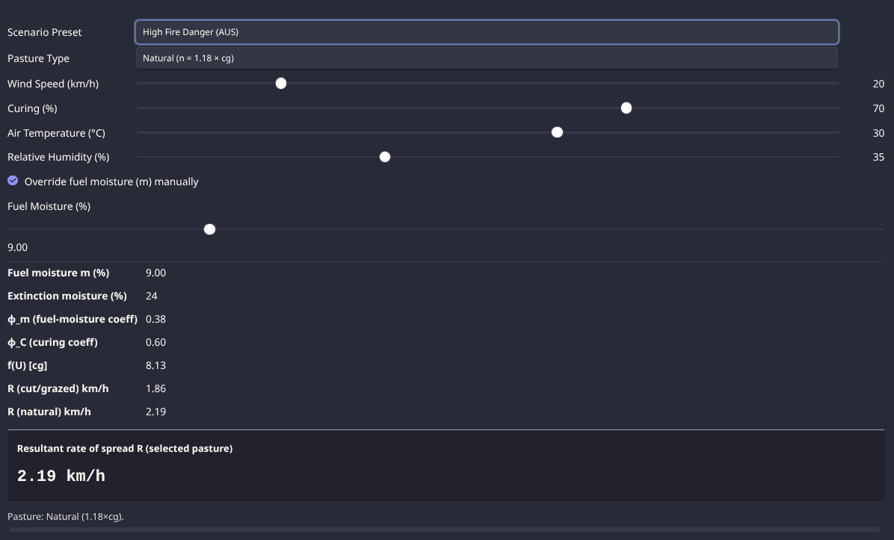
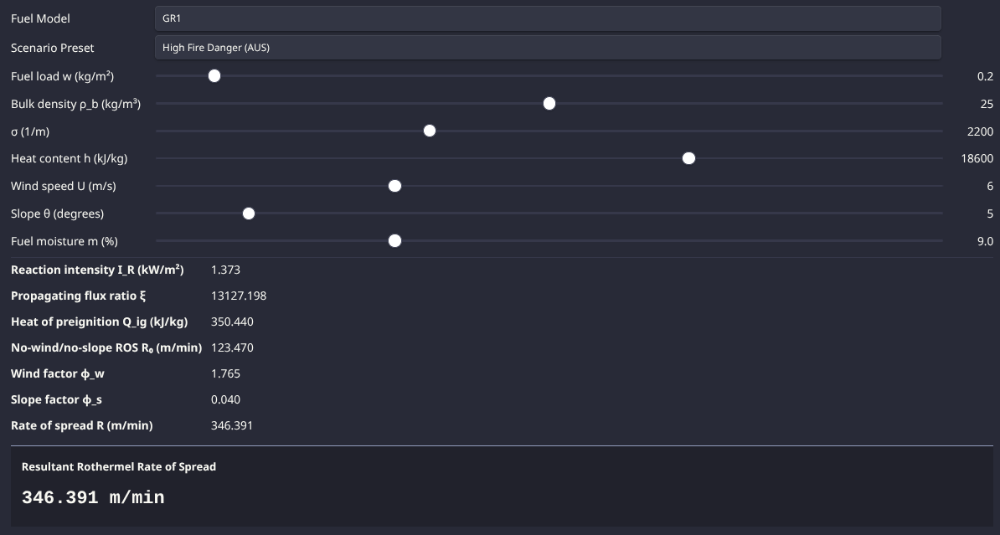

# 🌿 Obsidian Bushfire Modelling Notes

Welcome to the **Obsidian Bushfire Modelling Notes** vault!
This repository provides a structured and interactive resource for studying **bushfire mathematics** and **fire behaviour modelling**, designed for seamless use in [Obsidian](https://obsidian.md).

---

## ✨ Features

* **Bushfire Mathematics & Modelling**
  Detailed notes on classical and modern bushfire models, fire behaviour equations, and key scientific concepts.

* **Interactive Tools**
  JavaScript-based sliders embedded via [DataviewJS](https://blacksmithgu.github.io/obsidian-dataview/) let you adjust parameters and instantly explore model outcomes.

* **Structured Vault**
  Notes are organised into **definitions**, **equations**, **models**, and **interactive calculators** for easy study and navigation.

* **Tags & Aliases**
  Consistent tagging and aliasing allow fast searching and cross-linking across related notes.

* **Expandable & Modular**
  Designed for long-term growth—easily add new models, definitions, or interactive experiments.

### Slider Previews

These screenshots showcase the interactive sliders in action, allowing users to manipulate variables such as wind speed, slope, and fuel moisture to see real-time effects on fire spread rates.




---

## 📂 Folder Structure

```plaintext
bushfire-notes/                  # Main notes on bushfire models and concepts
definitions/                     # Definitions of key terms and models
equations/                       # Mathematical equations and derivations
javascript-interactive-sliders/  # Interactive JS sliders for model exploration
Bushfire Maths MOC.md            # Map of Content (MOC) for quick navigation
```

---

## 🛠️ Getting Started

1. **Clone or download** this repository.
2. Copy the folders (`bushfire-notes`, `definitions`, `equations`, `javascript-interactive-sliders`) into your Obsidian vault.
3. Open Obsidian and let it index the new notes.
4. Navigate using the **Bushfire Maths MOC.md** (Map of Content).
5. Explore **interactive sliders** on supported pages to experiment with fire behaviour parameters.

---

### 🔧 Requirements

* [Obsidian](https://obsidian.md)
* [Dataview Plugin](https://github.com/blacksmithgu/obsidian-dataview) (for dynamic tables, queries, and JavaScript embedding)

> **Note**: Interactive sliders require **DataviewJS enabled** in your Obsidian setup.

---

## 🧭 Organisation & Navigation

* **Map of Content (MOC)**
  Central hub (`Bushfire Maths MOC.md`) to access notes, definitions, and tools.

* **Tagging System**
  Notes are consistently tagged for quick filtering (e.g., `#mathematics/equations/mathematical-modelling/bushfire-models`).

* **Aliases**
  Each concept includes aliases for fast search and cross-referencing.

---

## 📌 Example Use Cases

* Learn how **Rothermel’s spread model** or **McArthur’s Forest Fire Danger Index** work.
* Adjust sliders for **wind speed**, **slope**, or **fuel moisture** and see the effects on spread rate in real time.
* Build your own bushfire model library by adding equations, notes, or simulation tools.
* Use as a **teaching resource** for bushfire science, mathematical modelling, or environmental studies.

---

## 🤝 Contributing

Contributions are welcome!
You can:

* Add new notes or definitions
* Improve clarity or accuracy
* Expand interactive tools

Submit your changes via **pull requests** or open an issue to suggest improvements.

---

## 📄 License

This project is licensed under the **GNU General Public License v3.0**.
See the [LICENSE](LICENSE) file for details.
